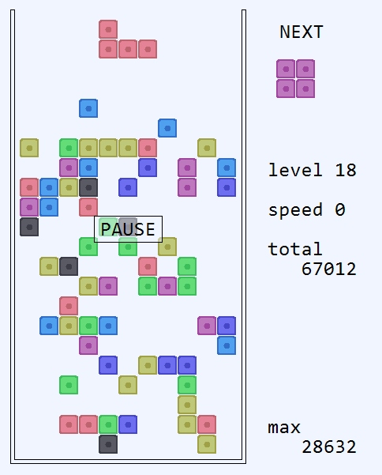
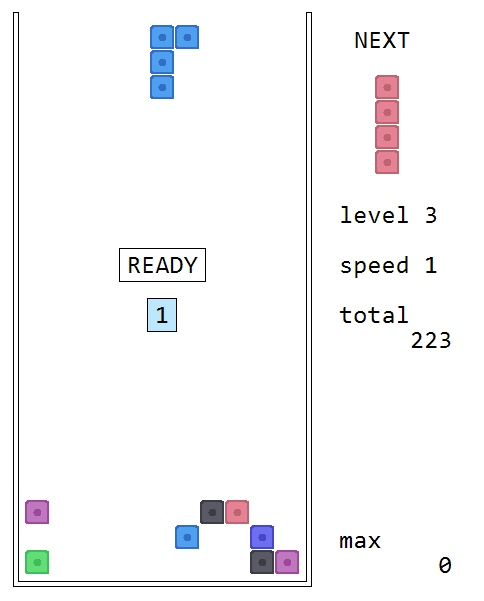
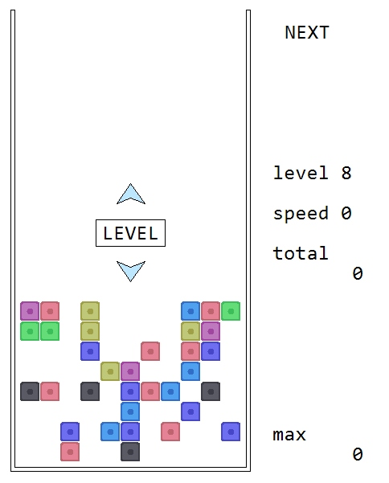
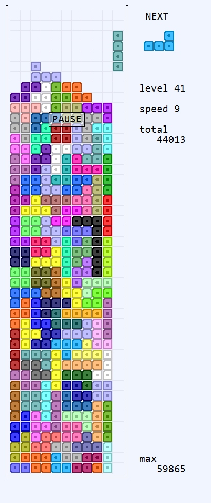
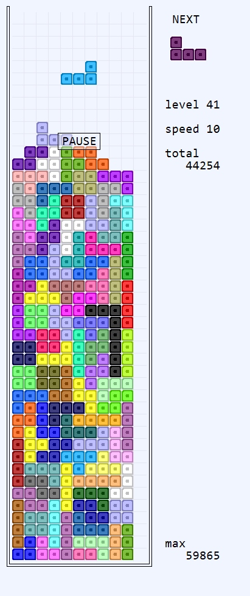

# TetrGDIP

[English version below](#english)

## Опис

Курсова робота з програмування - гра з падаючими фігурами. Реалізовано на мові C++ з використанням WinAPI та GDI+.

## Вимоги

- Операційна система Windows
- Microsoft Visual C++ Build Tools або Visual Studio Build Tools
- Windows SDK

## Збірка проекту

1. **Клонуйте репозиторій**:
   ```bash
   git clone https://github.com/viteck1048/tetrgdip.git
   cd tetrgdip
   ```

2. **Встановіть необхідні інструменти**:
   - Microsoft Visual C++ Build Tools
   - Windows 7.1 SDK

3. **Використовуйте надані скрипти для збірки**:
   - `trans.bat` - компіляція вихідного коду
   - `link.bat` - лінковка об'єктних файлів
   - `run.bat` - запуск зібраного додатку

## Керування

| Клавіша | Дія |
|---------|-----|
| ← → | Переміщення фігури вліво/вправо |
| ↑ | Обертання фігури |
| ↓ | Прискорити падіння |
| P | Пауза |
| H | Змінити шрифт |
| Ctrl+↑ | Збільшити масштаб шрифту |
| Ctrl+↓ | Зменшити масштаб шрифту |
| Esc | Вихід з гри |

> **Примітка:** Гра повністю сумісна з Wine (Linux) - скомпільований .exe файл чудово працює під керуванням Wine без додаткових налаштувань.

## Інтеграція з Notepad++

1. Встановіть плагін NppExec для Notepad++ (якщо ще не встановлено)
   - Відкрийте Notepad++
   - Перейдіть до `Plugins` -> `Plugins Admin`
   - Знайдіть `NppExec` у списку та встановіть

2. Додайте скрипт NppExec:
   - Натисніть `F6` або `Plugins` -> `NppExec` -> `Execute...`
   - Вставте наступний скрипт та збережіть його (кнопка `Save...`):
   ```
	NPP_SAVE
	NPP_CONSOLE +
	cmd.exe /c "SET FILE_NAME="$(FILE_NAME)" && SET FILE_D=$(CURRENT_DIRECTORY) && SET FILE_N=$(NAME_PART)&&trans.bat"
	NPP_CONSOLE -
	if "$(EXITCODE)" == "0"
		NPP_CONSOLE +
		cmd.exe /c "SET FILE_D=$(CURRENT_DIRECTORY) && SET FILE_N=$(NAME_PART)&&link.bat"
		NPP_CONSOLE -
	endif
	if "$(EXITCODE)" == "0"
	//  NPP_CONSOLE +
		cmd.exe /c "SET FILE_D=$(CURRENT_DIRECTORY)&& SET FILE_N=$(NAME_PART)&&run.bat"
		NPP_CONSOLE -
	endif
	if "$(EXITCODE)" == "0"
	NPP_CONSOLE 0
	endif

   ```

3. Для зручності створіть гарячу клавішу (наприклад, `F9`):
   - `Plugins` -> `NppExec` -> `Advanced Options...`
   - У полі `Associated script` виберіть ваш збережений скрипт
   - Натисніть `Add/Modify`
   - Встановіть бажану гарячу клавішу
   - Перезапустіть Notepad++

## Просто прикол

зміна H_LIN та V_LIN міняє габарити корзини


## Автор

[Viktor Diachenko](https://github.com/viteck1048)

---

# TetrGDIP

## Description

Programming coursework - a falling blocks game. Implemented in C++ using WinAPI and GDI+.

## Requirements

- Windows OS
- Microsoft Visual C++ Build Tools or Visual Studio Build Tools
- Windows SDK

## Building the Project

1. **Clone the repository**:
   ```bash
   git clone https://github.com/viteck1048/tetrgdip.git
   cd tetrgdip
   ```

2. **Install required tools**:
   - Microsoft Visual C++ Build Tools
   - Windows 7.1 SDK

3. **Use the provided build scripts**:
   - `trans.bat` - compile source code
   - `link.bat` - link object files
   - `run.bat` - run the application

## Controls

| Key | Action |
|-----|--------|
| ← → | Move piece left/right |
| ↑ | Rotate piece |
| ↓ | Soft drop (faster fall) |
| Space | Hard drop (instant drop) |
| P | Pause game |
| H | Change font |
| Ctrl+↑ | Increase font scale |
| Ctrl+↓ | Decrease font scale |
| Esc | Exit game |

> **Note:** The game is fully compatible with Wine (Linux) - the compiled .exe works perfectly under Wine without additional configuration.

## Notepad++ Integration

1. Install NppExec plugin for Notepad++ (if not already installed)
   - Open Notepad++
   - Go to `Plugins` -> `Plugins Admin`
   - Find `NppExec` in the list and install it

2. Add NppExec script:
   - Press `F6` or go to `Plugins` -> `NppExec` -> `Execute...`
   - Paste the following script and save it (click `Save...`):
   ```
 	NPP_SAVE
	NPP_CONSOLE +
	cmd.exe /c "SET FILE_NAME="$(FILE_NAME)" && SET FILE_D=$(CURRENT_DIRECTORY) && SET FILE_N=$(NAME_PART)&&trans.bat"
	NPP_CONSOLE -
	if "$(EXITCODE)" == "0"
		NPP_CONSOLE +
		cmd.exe /c "SET FILE_D=$(CURRENT_DIRECTORY) && SET FILE_N=$(NAME_PART)&&link.bat"
		NPP_CONSOLE -
	endif
	if "$(EXITCODE)" == "0"
	//  NPP_CONSOLE +
		cmd.exe /c "SET FILE_D=$(CURRENT_DIRECTORY)&& SET FILE_N=$(NAME_PART)&&run.bat"
		NPP_CONSOLE -
	endif
	if "$(EXITCODE)" == "0"
	NPP_CONSOLE 0
	endif
   ```

3. For convenience, create a hotkey (e.g., `F9`):
   - `Plugins` -> `NppExec` -> `Advanced Options...`
   - In `Associated script` field, select your saved script
   - Click `Add/Modify`
   - Set your preferred hotkey
   - Restart Notepad++

## Author

[Viktor Diachenko](https://github.com/viteck1048)

## Техническа документация

### Основа на проекта
Проектът е базиран на лична разработка "тетрис на ардуино" [Tinkercad проект](https://www.tinkercad.com/things/51vP7AlGOg3-tetris) с последваща разработка за Windows конзола.

### Архитектура
- **Модул tetr.h**:
  - Обработва команди за подготвяне на масиви
  - Управлява избора на тип игра и сложност (чрез функции `setup_X()`)
  - Контролира играта чрез променливата `scan` в `loop(typ_gry, scan)`

### Управление чрез клавиатура
- `VK_UP` – завъртане на фигурата
- `VK_LEFT`, `VK_RIGHT` – движение наляво/надясно
- `VK_DOWN` – ускорено движение надолу
- `VK_PAUSE`/`VK_PRIOR`/`VK_NEXT` – пауза
- `VK_RETURN` – избор в менюто (etap 0 и 2)
- `VK_SNAPSHOT` – скрийншот
- `VK_ESCAPE` – изход от играта (`DestroyWindow(hhhwww)`)

### Таймери
- **IDT_TIMER1**: Основен таймер (1 сек) с плавно намаляване по хиперболична крива
- **IDT_TIMER2**: Управлява ускоряването на IDT_TIMER1 (линейно нарастване)
- **IDT_TIMER3**: Активира се при натискане на DOWN (`fl_s` флаг), работи до `!prov_krok()`
- **IDT_TIMER4**: Управлява анимациите при изтриване на линии и края на играта

### Взаимодействие на обекти
- Използват се два основни масива:
  - `mas_rab[V_LIN + 3][H_LIN + 3]` – игрално поле с допълнителни граници
  - `fig_tek[4][4]` – текуща фигура
- Координатна система: `{y,x}`
- Допълнителните +3 в масива предотвратяват излизане извън границите
- Функция `prnt_podg()` попълва масива `mas_pr[V_LIN][H_LIN]`

### Визуализация
- **kubik()**:
  - Рисува кош, десни титри и базови блокове (kb1, kb2, kb3)
  - Използва макроси `X()` и `Y()` за независимо отразяване на координати
  - Премества се по матрицата и рисува блокове, когато `mas_pr[j][i] != 0`
  - Показва следващата фигура (`fig_next[4][4]`)
  - В менюто за избор на игра използва статичен `mas_preview`
  - Показва бутони ("Normal Game", "Adventure", "LEVEL") или съобщения ("PAUSE", "READY") в зависимост от `etap` и `pause`

### Допълнителни функции
- **GetEncoderClsid()**: Използва се за запазване на скрийншоти
- **shmarkli()**: Управлява анимацията при изтриване на линии:
  - Рисува бели квадратчета върху съществуващ кадър
  - Активира се от `IDT_TIMER4`
  - Блокира клавиатурата по време на анимацията
