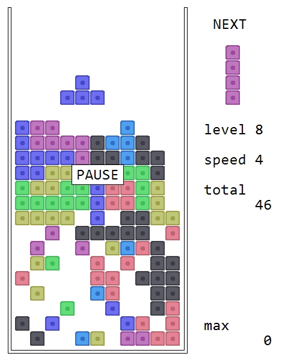
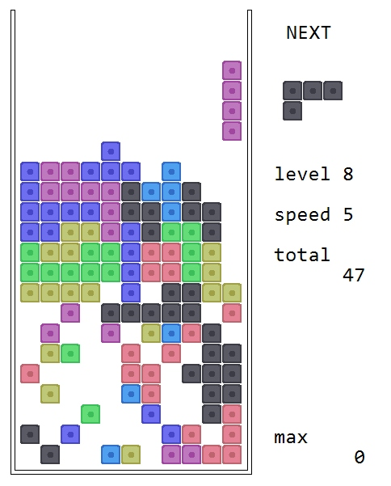
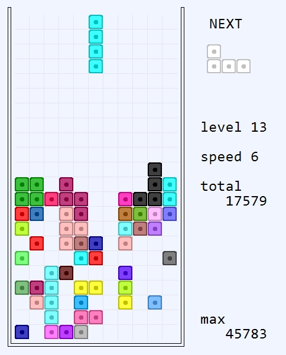
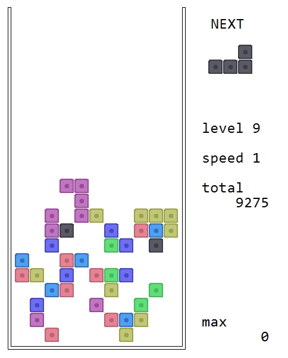

# TetrGDIP

[English version below](#english)

## Опис

Курсова робота з програмування - гра з падаючими фігурами. Реалізовано на мові C++ з використанням WinAPI та GDI+.

## Вимоги

- Операційна система Windows
- Microsoft Visual C++ Build Tools або Visual Studio Build Tools
- Windows SDK
- .NET Framework 4.0 або вище

## Збірка проекту

1. Клонуйте репозиторій:
   ```
   git clone https://github.com/viteck1048/tetrgdip.git
   cd tetrgdip
   ```
2. Встановіть необхідні інструменти:
   - Microsoft Visual C++ Build Tools
   - Windows 7.1 SDK

3. Використовуйте надані скрипти для збірки:
   - `trans.bat` - компіляція вихідного коду
   - `link.bat` - лінковка об'єктних файлів
   - `run.bat` - запуск зібраного додатку

## Керування

- ← → - переміщення фігури вліво/вправо
- ↑ - обертання фігури
- ↓ - прискорити падіння
- Пробіл - негайно опустити фігуру
- P - пауза
- H - змінити шрифт (циклічно перемикає між доступними моноширинними шрифтами)
- Ctrl+↑ - збільшити масштаб шрифту
- Ctrl+↓ - зменшити масштаб шрифту
- Esc - вихід з гри

> **Примітка:** Гра повністю сумісна з Wine (Linux) - скомпільований .exe файл чудово працює під керуванням Wine без додаткових налаштувань.

## Інтеграція з Notepad++

1. Встановіть плагін NppExec для Notepad++ (якщо ще не встановлено)
   - Відкрийте Notepad++
   - Перейдіть до `Plugins` -> `Plugins Admin`
   - Знайдіть `NppExec` у списку та встановіть

2. Додайте скрипт NppExec:
   - Натисніть `F6` або `Plugins` -> `NppExec` -> `Execute...`
   - Вставте наступний скрипт та збережіть його (кнопка `Save...`):
   ```
  NPP_CONSOLE -	//unicod
NPP_SAVE
NPP_CONSOLE +
cmd.exe /c "SET FILE_NAME="$(FILE_NAME)" && SET FILE_D=$(CURRENT_DIRECTORY) && SET FILE_N=$(NAME_PART)&&trans.bat"
NPP_CONSOLE -
if "$(EXITCODE)" == "0"
    NPP_CONSOLE +
    cmd.exe /c "SET FILE_D=$(CURRENT_DIRECTORY) && SET FILE_N=$(NAME_PART)&&link.bat"
    NPP_CONSOLE -
endif
if "$(EXITCODE)" == "0"
//  NPP_CONSOLE +
    cmd.exe /c "SET FILE_D=$(CURRENT_DIRECTORY)&& SET FILE_N=$(NAME_PART)&&run.bat"
    NPP_CONSOLE -
endif
if "$(EXITCODE)" == "0"
NPP_CONSOLE 0
endif

   ```

3. Для зручності створіть гарячу клавішу (наприклад, `F9`):
   - `Plugins` -> `NppExec` -> `Advanced Options...`
   - У полі `Associated script` виберіть ваш збережений скрипт
   - Натисніть `Add/Modify`
   - Встановіть бажану гарячу клавішу
   - Перезапустіть Notepad++

## Автор

[Viktor Diachenko](https://github.com/viteck1048)

---

# TetrGDIP

## Description

Programming coursework - a falling blocks game. Implemented in C++ using WinAPI and GDI+.

## Requirements

- Windows OS
- Microsoft Visual C++ Build Tools or Visual Studio Build Tools
- Windows SDK
- .NET Framework 4.0 or higher

## Building the Project

1. Clone the repository:
   ```
   git clone https://github.com/viteck1048/tetrgdip.git
   cd tetrgdip
   ```
2. Install required tools:
   - Microsoft Visual C++ Build Tools
   - Windows 7.1 SDK

3. Use the provided build scripts:
   - `trans.bat` - compile source code
   - `link.bat` - link object files
   - `run.bat` - run the application

## Controls

- ← → - Move piece left/right
- ↑ - Rotate piece
- ↓ - Soft drop (faster fall)
- Space - Hard drop (instant drop)
- P - Pause game
- H - Change font (cycles through available monospace fonts)
- Ctrl+↑ - Increase font scale
- Ctrl+↓ - Decrease font scale
- Esc - Exit game

> **Note:** The game is fully compatible with Wine (Linux) - the compiled .exe works perfectly under Wine without additional configuration.

## Notepad++ Integration

1. Install NppExec plugin for Notepad++ (if not already installed)
   - Open Notepad++
   - Go to `Plugins` -> `Plugins Admin`
   - Find `NppExec` in the list and install it

2. Add NppExec script:
   - Press `F6` or go to `Plugins` -> `NppExec` -> `Execute...`
   - Paste the following script and save it (click `Save...`):
   ```
 NPP_CONSOLE -	//unicod
NPP_SAVE
NPP_CONSOLE +
cmd.exe /c "SET FILE_NAME="$(FILE_NAME)" && SET FILE_D=$(CURRENT_DIRECTORY) && SET FILE_N=$(NAME_PART)&&trans.bat"
NPP_CONSOLE -
if "$(EXITCODE)" == "0"
    NPP_CONSOLE +
    cmd.exe /c "SET FILE_D=$(CURRENT_DIRECTORY) && SET FILE_N=$(NAME_PART)&&link.bat"
    NPP_CONSOLE -
endif
if "$(EXITCODE)" == "0"
//  NPP_CONSOLE +
    cmd.exe /c "SET FILE_D=$(CURRENT_DIRECTORY)&& SET FILE_N=$(NAME_PART)&&run.bat"
    NPP_CONSOLE -
endif
if "$(EXITCODE)" == "0"
NPP_CONSOLE 0
endif

   ```

3. For convenience, create a hotkey (e.g., `F9`):
   - `Plugins` -> `NppExec` -> `Advanced Options...`
   - In `Associated script` field, select your saved script
   - Click `Add/Modify`
   - Set your preferred hotkey
   - Restart Notepad++

## Author

[Viktor Diachenko](https://github.com/viteck1048)

За основа взел собствен проект «тетрис на ардуино» https://www.tinkercad.com/things/51vP7AlGOg3-tetris и последваща доработка за конзола windows. Модульт “tetr.h” приема команди за подготвене на масиви, избиране на тип на игра, установка на сложността (функции setup_X()), управление по време на игра (променлива scan вьв loop(typ_gry, scan)).
scan == 1, 2, 3, 4 или 0.
1 – 4 сьответства на натиснати копчета UP, LEFT, DOWN, RIGHT,
0 – движение надолу по сработване на таймер IDT_TIMER1 или IDT_TIMER3.
IDT_TIMER1 = 1сек сьс бавно намаление по гиперболическа крива (намаляне на IDT_TIMER1 управлява от IDT_TIMER2, коят се увеличава линейно)
IDT_TIMER3 сьс тайминг ‘0’ задейства след натискане на DOWN,  вдигна флаг fl_s и работи до !prov_krok() – невозможност за продолжение на движение надолу. Флаг fl_s блокира вьвеждане от клавиатура. Идея сьс исползване на таймер сьстои в желание да пропускам чрез WinProc случайни натискания на клавиатура по време на бьрз ход надолу, а не натрупване на сьобщения, по сьща логика работи таймер IDT_TIMER4 (задейства по време на изтриване на заполнени линии и цяло поле в края на игра (функция shmarkli()))
Взаимодействие между фигура и кошон разщитва спомощта на 2 служебни масиви mas_rab[V_LIN + 3][H_LIN + 3] и fig_tek[4][4] и координати на фигура {y,x} (‘+3’ за недопускане на излизане извьн масива при наложении mas_rab + fig_tek и детектиране на препятствие). функция prnt_podg() заполнява масив mas_pr[V_LIN][H_LIN].
Функция kubik() получава размери на базов блок. Макроси ‘int X/Y(float)’ позволяват да представя плот за рисуване като координатно поле X * Y вне зависимост от размера на прозорец.
Функция рисува кош, десни титри, базов блок(kb1, kb2, kb3) сьс габарити X(1)хY(1). Вьв вложени цикли матрица премества по игрово поле и ако ‘mas_pr[j][i] != 0’ рисува базов блок сьс сьответветния цвят. По сьщ начин рисува следваща фигура (fig_next[4][4]). В меню за избора на тип на игра (etap == 0) вместо mas_pr исползва статичен mas_preview.
Накрая в зависимост от etap и pause вьрху игрово поле рисува кнопки("Normal Game", "Adventure", "LEVEL" ’↑’ ‘↓’) или сьобщения(“PAUSE”, “READY”).
Функция GetEncoderClsid() и блок ‘if(save)’ функции DRAW_TEST__() сохраняват скриншот на отрисован вьв DRAW_TEST() кадр (картинки в тази документ направила сама игра.)(WM_KEYUP-> VK_SNAPSHOT->{save = 1;updateWindow();})
Функция shmarkli() изтрива линии (soply[i] == 1(заплнява се вьв функция prov_lin())) тьй като рисува бели квадратчета вьрху необновен кадр (без ‘graphics.Clear(Color(255, 255, 255))’ <=> ‘graphics.Clear(Color(0, 0, 0, 0))’).
Негов таймер (IDT_TIMER4) включва при f_sop == 1(функция prov_lin()) или f_sop_ver == 1(loop()->край на игра), блокира клавиатура и работи до f_sop == H_LIN
Управление:
VK_UP – ротация,
VK_LEFT, VK_RIGHT – ляво, дясно,
VK_DOWN – ускорено движение надолу, 
VK_PAUSE || VK_PRIOR || VK_NEXT – пауза, 
VK_RETURN – ввод  в меню etap 0 и 2,
VK_SNAPSHOT – скриншот, 
VK_ESCAPE - DestroyWindow(hhhwww);

## Знімки екрану з гри


*Початок гри*


*Ігровий процес*


*Рівень складності*


*Меню вибору режиму*


*Налаштування складності*


*Ігровий процес 2*


*Анімація зникнення ліній*


*Завершення гри*
